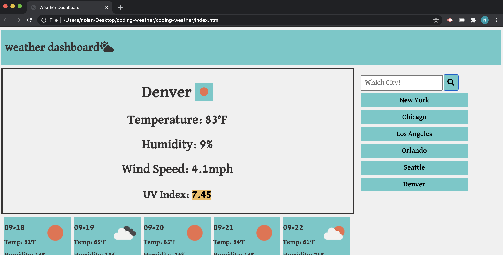
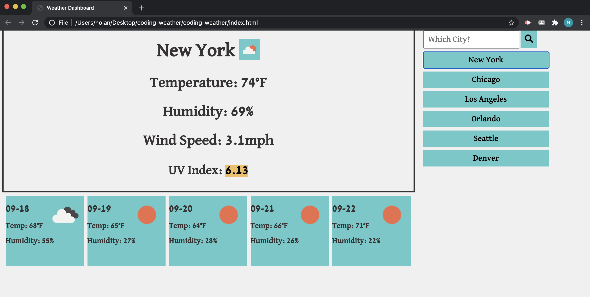

# coding-weather

The purpose of this website is to provide the user with current weather and a weather forecast of the city the decide to search.

This projects features a single html page linked to a JS and a CSS:

The WEATHER DASHBOARD page contains a:

Header title with the project title.

A section in which city weather information will pop up.

A section with a text input box asking for a city.

A button for the user to submit their city.

A section with 5 boxes that contain the information on the 5 day forecast of the searched cities weather.

## Getting started and deployment

This site can be accessed by clicking the link below...

https://nolanws1.github.io/coding-weather/

## Built With
* HTML
* CSS
* JAVASCRIPT
* <a rel="stylesheet" href="https://fonts.google.com/">Google Fonts</a>

## Created by

Nolan Sanchez / UCR Extension Program Coding Bootcamp Student

## Screenshots

